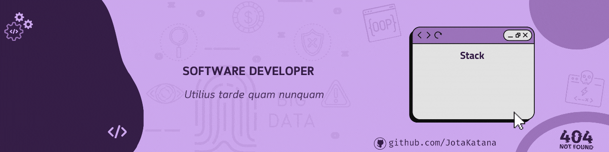

<h2 align="center"> 
	🚧  Estudo POO C# ♻️ Polimorfismo 🚀 🚧
</h2>

 <a href="#-sobre-o-projeto">Sobre</a> •
 <a href="#-funcionalidades">Funcionalidades</a> •
 <a href="#-layout">Layout</a> • 
 <a href="#-como-executar-o-projeto">Como executar</a> • 
 <a href="#-tecnologias">Tecnologias</a> • 
 <a href="#-autor">Autor</a> • 
 <a href="#user-content--licença">Licença</a>

## 📄 Descrição do entregável

- POO3 (Arquivo do código desenvolvido) 

---

## 💻 Sobre o projeto

Projeto focado no aprendizado da linguagem, introduzindo o a programção orientada a objetos em C#.

---

## ⚙️ Funcionalidades

- [x] Conhecimento de desenvolvimento com Polimorfismo + Heranças.
- [x] Estudo Introdutório.
---

## 🎨 Layout

---

## 🚀 Como executar o projeto

1 - Baixar o Projeto  
2 - Rodar o arquivo

### Pré-requisitos

Antes de começar, você vai precisar ter instalado em sua máquina as seguintes ferramentas:
[Git](https://git-scm.com).
Além disto é bom ter um editor para trabalhar com o código como [Visual Studio](https://visualstudio.microsoft.com/pt-br/)

---

## 🛠 Tecnologias

A seguinte linguagem de programação foi usada na construção do projeto:

---

## 🦸 Autor

  

---

## 📝 Licença
Este projeto esta sobe a licença [MIT](./LICENSE).

